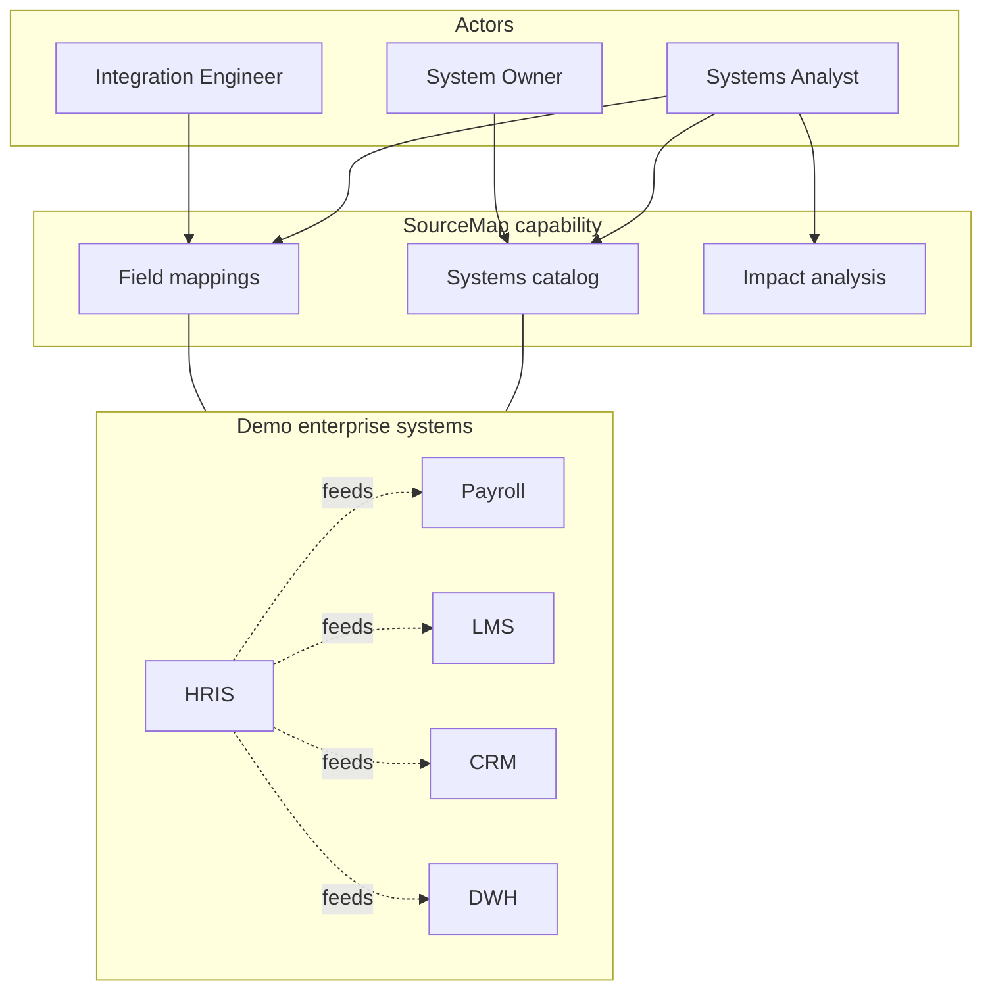

# Context — SourceMap

## Purpose

Define the business problem, scope, and assumptions for an enterprise **systems inventory and integration lineage** capability (“SourceMap”).

## Business problem

Mid-size organizations run dozens of overlapping applications (HR, finance, sales, learning, analytics). When a field changes in the system of record—rename, type change, PII reclassification, or deprecation—teams discover downstream breakage **after** payroll misfires, provisioning failures, or broken reports.

Today, integration knowledge lives in:

- Tribal memory and one-off spreadsheets
- Interface runbooks that describe files/APIs but not **field-level** mappings
- Ticket archives with no searchable lineage

**SourceMap** centralizes:

1. Systems catalog (owners, domain, status)
2. Field inventory per system
3. Source→target mappings tied to interface contracts
4. Impact analysis: “what breaks if `HRIS.employment_status` changes?”

## Scope

| In scope | Out of scope |
|----------|----------------|
| Read-only catalog UI for demo | Production MDM or data governance workflow |
| Field-level mappings + transforms | Live API connectivity to source systems |
| Interface contract metadata (protocol, SLA) | Automated schema drift detection |
| Impact graph for selected field | Role-based access control / SSO |
| Fictional seed data (HRIS, Payroll, LMS, CRM, DWH) | Real organizational or employee data |

## Assumptions

- HRIS is the **system of record** for employee master data in the demo landscape.
- Integrations are batch or near-real-time feeds documented as **contracts**, not implemented ETL engines in this prototype.
- “Critical” on a mapping flags payroll/compliance paths requiring change advisory board review.
- Stakeholders accept a **working catalog prototype** as proof that analysis can drive a buildable UI.

## Context diagram

## Success measures (portfolio demo)

- Recruiter can open README and see **analysis before code**.
- Demo runs locally in under two minutes (`npm install` / `npm run dev`).
- Happy path: browse systems → inspect mappings → select field → view blast radius.
