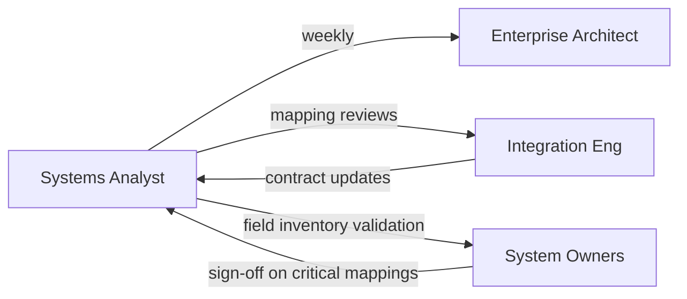

# Stakeholders & RACI — SourceMap

## Purpose

Identify stakeholders and decision accountability for cataloging systems, documenting mappings, and running change impact analysis.

## Stakeholder register

| Stakeholder | Interest | Influence |
|-------------|----------|-----------|
| Enterprise Architect | Consistent integration patterns, reduced duplication | High |
| Systems Analyst (product owner for this artifact) | Traceable requirements, demo proving spec → UI | High |
| Integration / ETL Engineering | Accurate field mappings and transforms | High |
| HR / People Operations (HRIS owner) | Employee data quality and change control | Medium |
| Finance (Payroll owner) | Pay run integrity | High |
| Data Platform (DWH owner) | Dimension stability for reporting | Medium |
| Compliance / InfoSec | PII tagging and interface SLAs | Medium |
| Program / PMO | Visibility for change requests | Low |

## RACI matrix

| Activity | Enterprise Architect | Systems Analyst | Integration Eng | System Owner | Compliance |
|----------|---------------------|-----------------|---------------|--------------|------------|
| Define catalog scope | A | R | C | C | I |
| Maintain systems inventory | C | R | I | A | I |
| Author field mappings | I | R | A | C | C |
| Approve interface contracts | A | R | C | C | C |
| Run impact analysis for CR | C | R | C | I | I |
| Classify PII on fields | I | R | I | C | A |
| Prioritize demo vs production roadmap | A | R | C | I | I |

**Legend:** R = Responsible, A = Accountable, C = Consulted, I = Informed

## Communication plan (demo phase)

## Escalation

- **Critical mapping change** without impact review → escalate to Enterprise Architect + affected system owner within one business day.
- **PII reclassification** → Compliance must consult before demo data model updates (production would gate releases).
