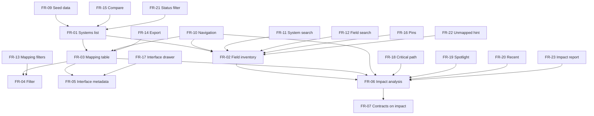

# Requirements — SourceMap

## Purpose

What the SourceMap prototype must do — each FR maps to a view or function in the demo app.

## Functional requirements

| ID | Requirement | Priority |
|----|-------------|----------|
| FR-01 | Display a list of registered systems with owner, domain, and status | Must |
| FR-02 | Show field inventory for a selected system (name, type, PII, description) | Must |
| FR-03 | Display all field-level mappings as source.system.field → target.system.field | Must |
| FR-04 | Filter mappings by system name, field name, interface, or transform text | Should |
| FR-05 | Link mappings to interface contract metadata (protocol, frequency, SLA) | Must |
| FR-06 | Select any field and compute impact: direct mappings, upstream/downstream fields | Must |
| FR-07 | Surface interface contracts associated with the selected field | Must |
| FR-08 | Flag mappings as critical for change-advisory emphasis | Should |
| FR-09 | Seed demo data locally (no backend) | Must |
| FR-10 | Navigate between catalog, mappings, and impact views | Must |
| FR-11 | Search/filter systems in the catalog sidebar | Should |
| FR-12 | Search/filter fields within a selected system inventory | Should |
| FR-13 | Filter mappings by critical-only and by interface protocol | Should |
| FR-14 | Export visible mapping rows as JSON or CSV download | Should |
| FR-15 | Compare two systems for shared interfaces and cross mappings | Could |
| FR-16 | Pin/bookmark fields (persisted in browser localStorage) | Could |
| FR-17 | Open interface contract detail drawer from mappings or impact | Should |
| FR-18 | Highlight critical downstream path on impact blast radius | Should |
| FR-19 | Global field spotlight — jump to impact from any field | Should |
| FR-20 | Recent fields strip (localStorage) for repeat analysis | Could |
| FR-21 | Filter systems catalog by production/staging/deprecated | Should |
| FR-22 | Show unmapped field count per system in catalog | Could |
| FR-23 | Copy markdown impact report to clipboard | Should |

## Non-functional requirements

| ID | Requirement | Target |
|----|-------------|--------|
| NFR-01 | Local startup | `npm run dev` on developer workstation |
| NFR-02 | Browser support | Latest Chrome / Edge / Firefox |
| NFR-03 | Performance | Impact analysis < 100ms on seed dataset |
| NFR-04 | Accessibility | Keyboard-selectable field rows; labeled controls |
| NFR-05 | Maintainability | Typed TypeScript models mirroring analysis data dictionary |
| NFR-06 | Security (demo) | No secrets, no real PII; fictional seed only |

## Constraints

- Stack: Vite + React + TypeScript (local seed, no backend).
- Specs in `docs/` lead the README; the app proves the analysis.

## Requirements dependency view

