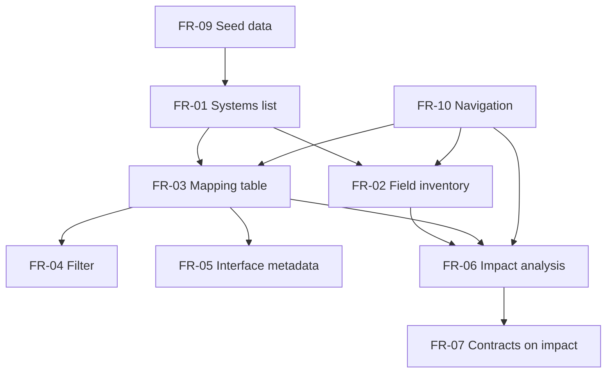

# Requirements — SourceMap

## Purpose

Functional and non-functional requirements for the SourceMap catalog prototype.

## Functional requirements

| ID | Requirement | Priority |
|----|-------------|----------|
| FR-01 | Display a list of registered systems with owner, domain, and status | Must |
| FR-02 | Show field inventory for a selected system (name, type, PII, description) | Must |
| FR-03 | Display all field-level mappings as source.system.field → target.system.field | Must |
| FR-04 | Filter mappings by system name, field name, interface, or transform text | Should |
| FR-05 | Link mappings to interface contract metadata (protocol, frequency, SLA) | Must |
| FR-06 | Select any field and compute impact: direct mappings, upstream/downstream fields | Must |
| FR-07 | Surface interface contracts associated with the selected field | Must |
| FR-08 | Flag mappings as critical for change-advisory emphasis | Should |
| FR-09 | Seed demo data locally (no backend) | Must |
| FR-10 | Navigate between catalog, mappings, and impact views | Must |

## Non-functional requirements

| ID | Requirement | Target |
|----|-------------|--------|
| NFR-01 | Local startup | `npm run dev` on developer workstation |
| NFR-02 | Browser support | Latest Chrome / Edge / Firefox |
| NFR-03 | Performance | Impact analysis < 100ms on seed dataset |
| NFR-04 | Accessibility | Keyboard-selectable field rows; labeled controls |
| NFR-05 | Maintainability | Typed TypeScript models mirroring analysis data dictionary |
| NFR-06 | Security (demo) | No secrets, no real PII; fictional seed only |

## Constraints

- Vite + React + TypeScript stack (portfolio standard for lightweight UI).
- Analysis documents lead README; code validates the spec.

## Requirements dependency view

