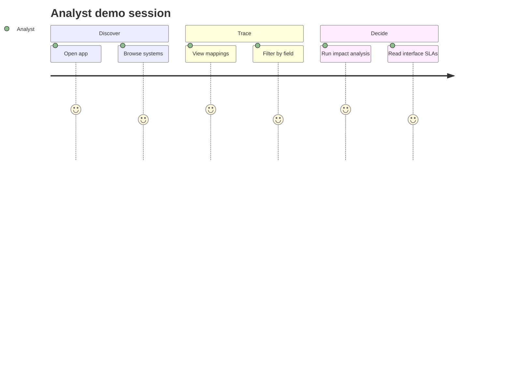

# Use Cases & User Stories — SourceMap

## Purpose

Describe primary interactions and acceptance-oriented stories for the SourceMap demo.

## Actors

- **Systems Analyst** — primary user; maintains catalog and runs impact analysis
- **Integration Engineer** — validates mappings and transforms
- **System Owner** — confirms inventory accuracy

## Use case UC-01 — Browse systems catalog

**Goal:** Understand which systems exist and who owns them.

**Main flow:**

1. Analyst opens the Systems catalog view.
2. System list shows acronym, status, owner, domain.
3. Analyst selects HRIS.
4. Field table lists employee_id, work_email, employment_status, etc.

**Postcondition:** Analyst can reference authoritative field names during change requests.

## Use case UC-02 — Review field mappings

**Goal:** Trace how HRIS fields land in downstream systems.

**Main flow:**

1. Analyst opens Field mappings view.
2. Table shows source → target rows with interface name and transform.
3. Analyst filters for `employment_status`.
4. Rows highlight HRIS→Payroll, HRIS→LMS, HRIS→DWH mappings.

## Use case UC-03 — Impact analysis

**Goal:** Answer “what breaks if field X changes?”

**Main flow:**

1. Analyst opens Impact analysis (or clicks a field from catalog/mappings).
2. Selects `HRIS.employment_status`.
3. Summary shows direct mapping count, critical count, downstream/upstream fields.
4. Blast radius lists affected targets (Payroll.pay_status, LMS.account_active, DWH.employment_status).
5. Interface contracts section lists HRIS→Payroll, HRIS→LMS, HRIS→DWH with SLAs.

**Alternate:** Field with no mappings shows origin node only and empty contract list.

## User stories

| ID | Story | Acceptance criteria |
|----|-------|---------------------|
| US-01 | As an analyst, I want a systems list so I know scope of the landscape | Given seed loaded, when I open Systems, then I see ≥3 systems with owner and status |
| US-02 | As an analyst, I want field details per system so I can speak precisely in CRs | When I select HRIS, then I see employee_id with type UUID and PII flags |
| US-03 | As an integration engineer, I want mapping transforms visible so I can verify logic | Mapping table shows transform text for status enumerations |
| US-04 | As an analyst, I want impact view so I can scope regression testing | Selecting work_email shows LMS and CRM downstream paths |
| US-05 | As an owner, I want critical flags so payroll paths are obvious | employment_status mappings to Payroll show critical = Yes |

## Story map (demo)

