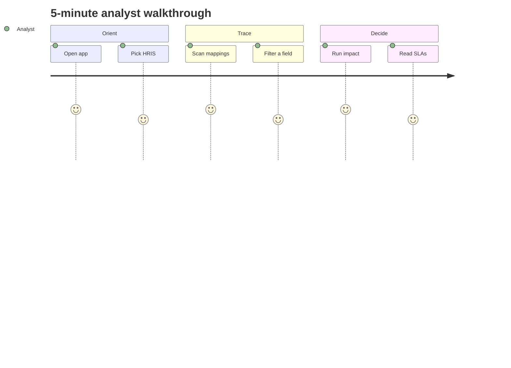

# Use Cases & User Stories — SourceMap

## Purpose

Three core flows the demo supports — written for a quick walkthrough, not a full BRD.

## Actors

| Actor | Role |
|-------|------|
| **Systems Analyst** | Owns catalog accuracy; runs impact for change requests |
| **Integration Engineer** | Validates transforms and interface timing |
| **System Owner** | Confirms inventory matches production |

## UC-01 — Browse systems catalog

1. Open **Systems catalog**.
2. Scan acronym, status, owner, domain.
3. Select **HRIS** → field table (`employee_id`, `work_email`, `employment_status`, …).

**Outcome:** Authoritative field names for CRs and test plans.

## UC-02 — Review field mappings

1. Open **Field mappings**.
2. Scan source → target rows with interface and transform.
3. Filter `employment_status` → see HRIS→Payroll, LMS, DWH paths.

**Outcome:** Lineage visible without opening integration code.

## UC-04 — Compare integration boundaries

1. On **Systems catalog**, scroll to **Compare two systems**.
2. Select **HRIS** and **Payroll**.
3. Review cross mappings, shared interfaces, and unlinked field names.

**Outcome:** Scope gap analysis before a dual-system change window.

## UC-05 — Export filtered mappings

1. Open **Field mappings**, filter `employment_status`, enable **Critical only**.
2. Click **Export JSON** or **Export CSV** for the visible rows.

**Outcome:** Share lineage with engineers without copying from the table.

## UC-06 — Pin recurring fields

1. Select HRIS → click ☆ on `employment_status`.
2. Use the **Pinned** strip in the header to jump back to impact.

**Outcome:** Faster repeat analysis during a change advisory workshop.

## UC-03 — Impact analysis

1. Open **Impact analysis** (or click a field from catalog/mappings).
2. Choose `HRIS.employment_status`.
3. Read counts, blast radius, and interface SLAs.
4. Click **Copy impact report** to paste into a change ticket.

**Alternate:** Unmapped fields show origin only and an empty contract list.

## UC-07 — Spotlight jump

1. Type `email` in the header **Spotlight** box.
2. Select `HRIS.work_email` — impact view opens with that field selected.

**Outcome:** No need to drill catalog first during a live workshop.

## User stories (acceptance snapshot)

| ID | Story | Pass when |
|----|-------|-----------|
| US-01 | Systems list for landscape scope | ≥3 systems with owner + status on **Systems** |
| US-02 | Field detail per system | HRIS shows `employee_id` (UUID) and PII on email |
| US-03 | Transforms visible | Mapping table shows status enumeration logic |
| US-04 | Impact for regression scope | `work_email` shows LMS + CRM downstream |
| US-05 | Critical paths obvious | `employment_status` → Payroll marked critical |
| US-06 | System search narrows list | Filter `payroll` shows Payroll system only |
| US-07 | Export respects filters | CSV row count matches filtered table |
| US-08 | Interface drawer from mapping | Click interface name → SLA and notes visible |
| US-09 | Critical path highlighted | Impact nodes on lime outline for critical hops |
| US-10 | Spotlight finds fields | Header search lists matching seed fields |
| US-11 | Impact report export | Copy button produces markdown summary |

## Demo journey

