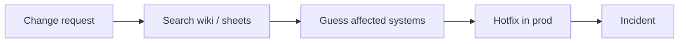
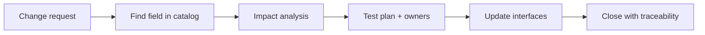
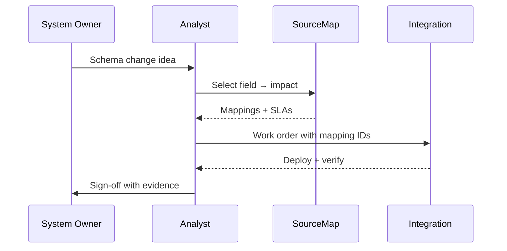

# Process — As-Is to To-Be — SourceMap

## Purpose

Show why a field catalog beats hunting spreadsheets when a schema change lands.

## As-is (today)

**Pain:** Late discovery, duplicate mappings, no shared field glossary.

## To-be (with SourceMap)

**Gain:** Blast radius and contracts before code changes.

## Who does what (to-be)

## Demo scope

The app covers **read-only catalog + impact**. Tickets, CAB automation, and write-back to a governance DB are documented here as future phases.
