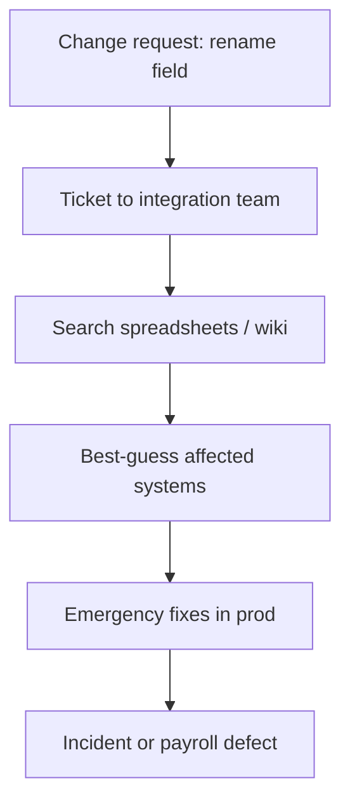
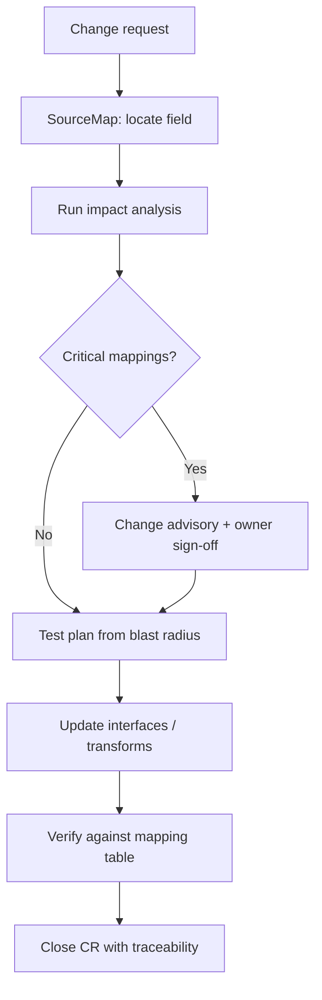
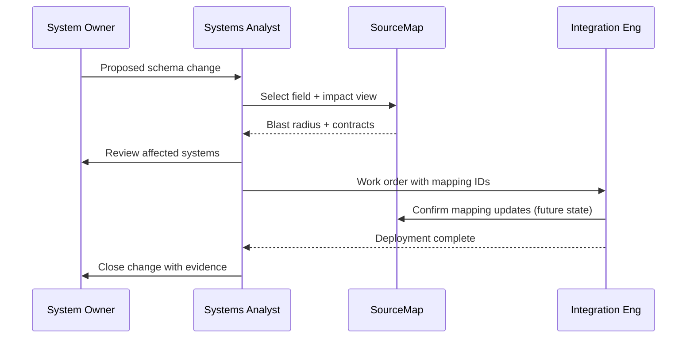

# Process — As-Is to To-Be — SourceMap

## Purpose

Contrast today’s ad-hoc integration documentation with a catalog-driven change impact process.

## As-is process (pain)

**Problems:** Late discovery, duplicate mappings undocumented, no single field glossary.

## To-be process (target)

## Swimlane (to-be)

## Demo scope note

The prototype implements **catalog + impact read paths** only. Workflow tickets, CAB automation, and write-back to a governance database are future phases documented here for process completeness.
