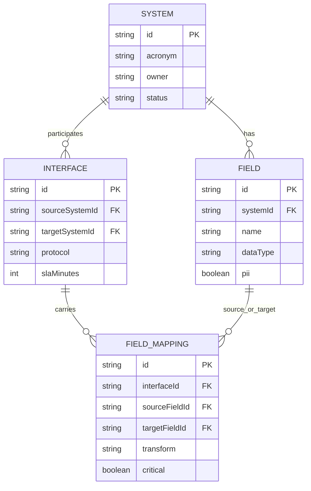
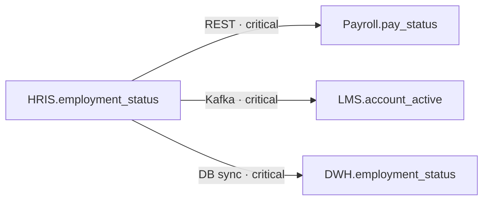

# Data Model — SourceMap

## Purpose

Logical entities for the demo catalog — enough to read the UI and seed file, not a physical DDL.

## Core model

## Field cheat sheet

| Entity | What it stores |
|--------|----------------|
| **System** | App or platform in the landscape (`sys-hris`, acronym, owner, status) |
| **Field** | Column/attribute on a system (type, PII flag, description) |
| **Interface** | Feed between two systems (protocol, schedule, SLA minutes) |
| **Field mapping** | One source field → one target field on an interface (+ transform, critical) |

## Seed systems (demo)

| Acronym | Role |
|---------|------|
| HRIS | System of record |
| Payroll | Pay eligibility |
| LMS | Provisioning via email |
| CRM | Sales roster |
| DWH | Analytics dimension |

## Example lineage — `employment_status`

