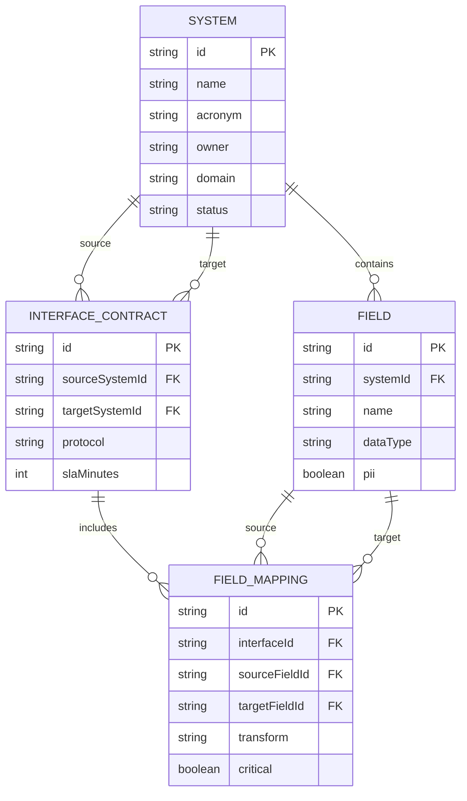
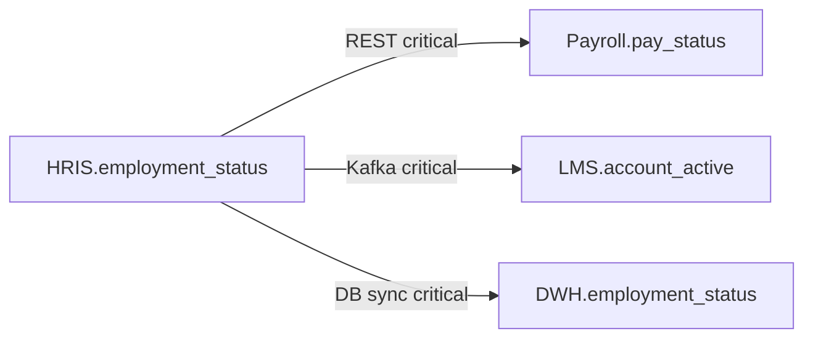

# Data Model — SourceMap

## Purpose

Logical entities, relationships, and demo data dictionary for the catalog.

## Entity-relationship diagram

## Data dictionary (excerpt)

### System

| Attribute | Description |
|-----------|-------------|
| id | Stable key (e.g. `sys-hris`) |
| acronym | Short label shown in UI |
| status | production \| staging \| deprecated |

### Field

| Attribute | Description |
|-----------|-------------|
| name | Physical/logical column name in source system |
| dataType | UUID, string, enum, date, boolean |
| pii | Marks fields requiring privacy review |

### Interface contract

| Attribute | Description |
|-----------|-------------|
| protocol | REST, SFTP, Kafka, DB sync |
| frequency | Human-readable schedule |
| slaMinutes | Recovery target for stale feeds |

### Field mapping

| Attribute | Description |
|-----------|-------------|
| transform | Direct copy or expression (demo text) |
| critical | When true, highlighted on impact summary |

## Seed landscape summary

| System | Role in demo |
|--------|----------------|
| HRIS | System of record |
| Payroll | Compensation eligibility |
| LMS | Provisioning via email |
| CRM | Sales roster / territory |
| DWH | Analytics dimension |

## Key lineage (employment_status)

