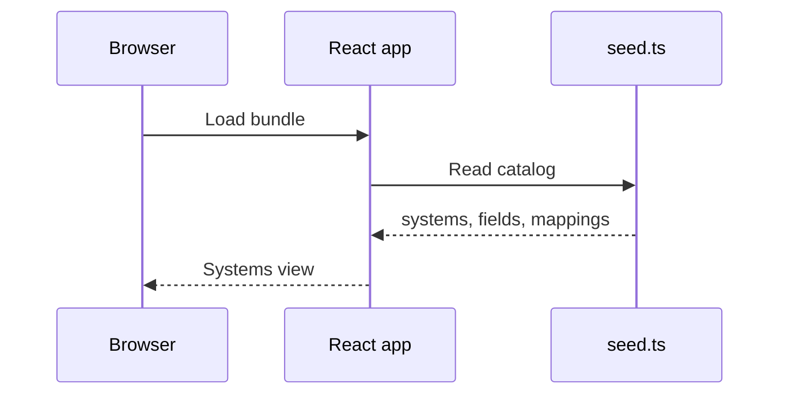
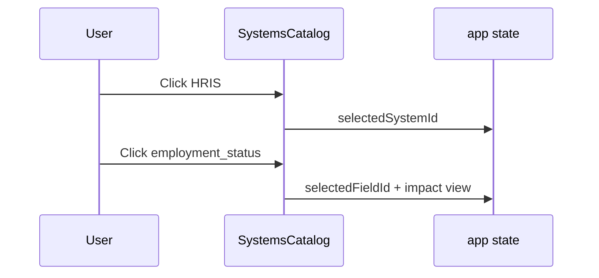
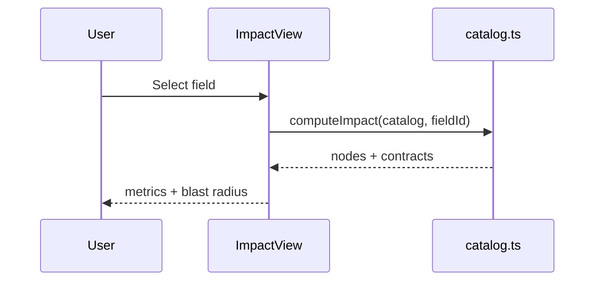
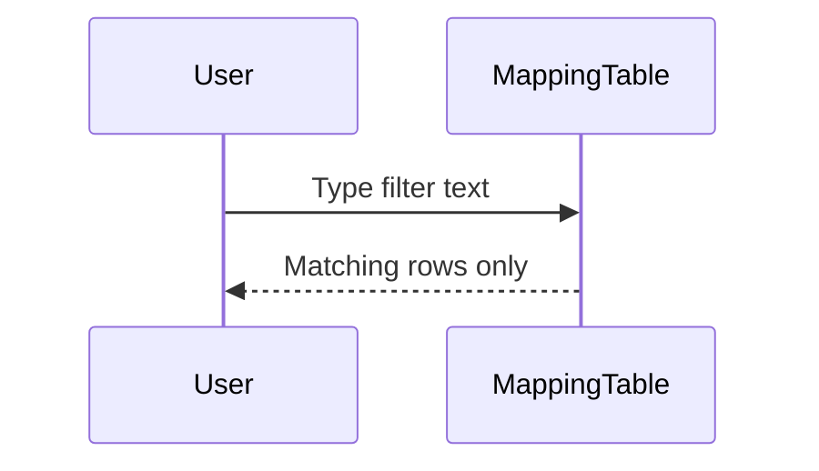

# Sequence Flows — SourceMap

## Purpose

How the **read-only demo UI** loads seed data and responds to clicks (no API).

## SF-01 — App load

## SF-02 — Pick system → field → impact

## SF-03 — Compute impact

## SF-04 — Filter mappings

## Out of scope (future)

Editing mappings would add validation, persistence (API or git-backed YAML), and optimistic UI — tracked in the requirements backlog.
