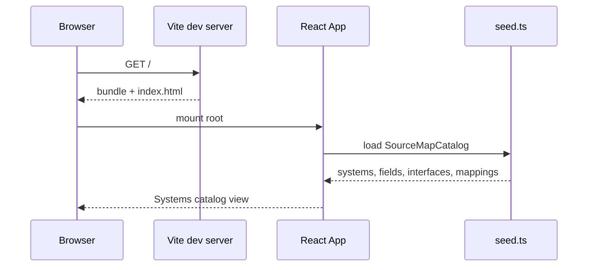
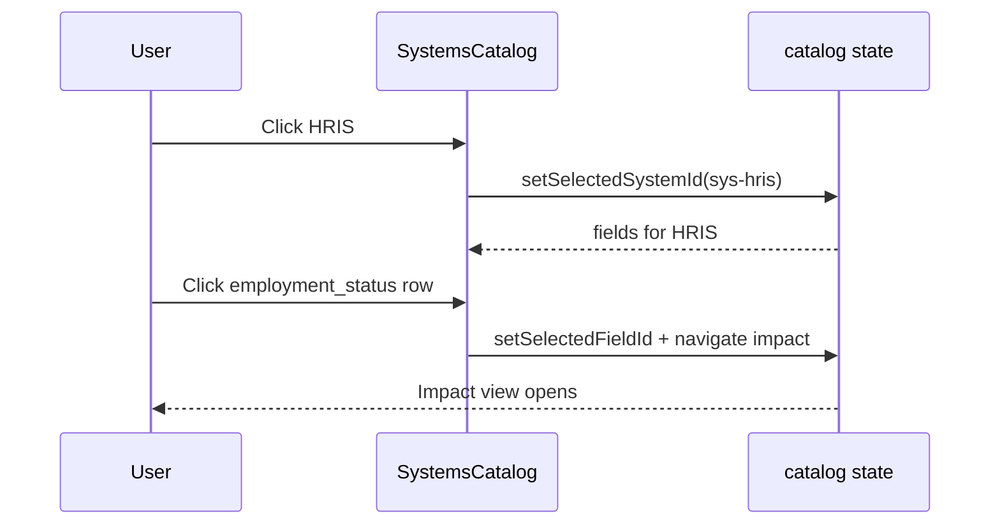
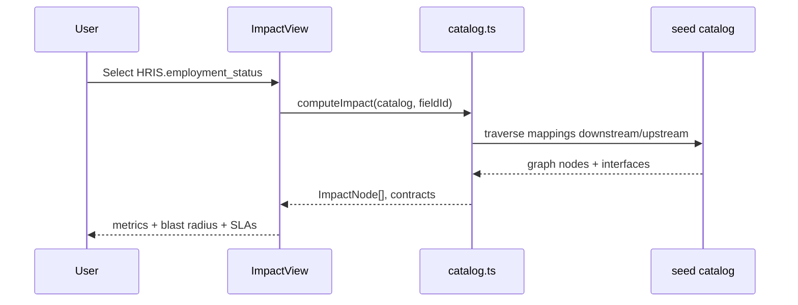
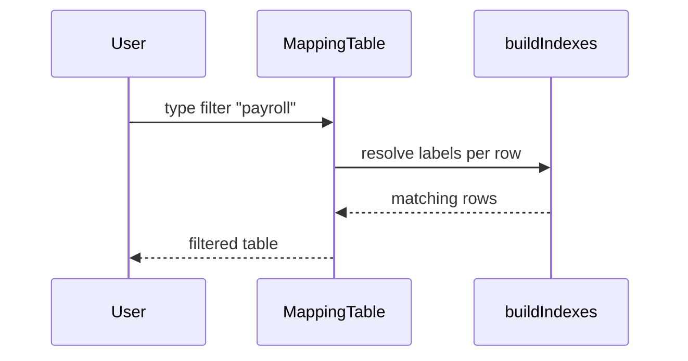

# Sequence Flows — SourceMap

## Purpose

Key runtime interactions in the **read-only demo UI** (local seed, no API).

## SF-01 — Application bootstrap

## SF-02 — Select system and field

## SF-03 — Compute impact analysis

## SF-04 — Filter mappings

## Future-state sequence (out of demo scope)

Write-back of mapping edits would add validation, optimistic UI, and persistence (API or git-backed YAML). Documented for traceability to FR backlog.
