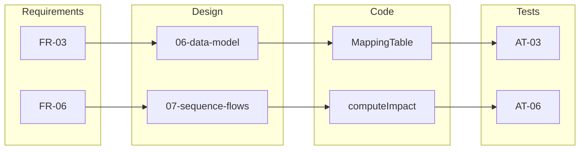

# Traceability Matrix — SourceMap

## Purpose

One row per requirement — where it lives in docs, code, and manual tests.

| Req ID | Design artifact | Implementation | Test (09) |
|--------|-----------------|----------------|-----------|
| FR-01 | 01-context, 06-data-model | `SystemsCatalog`, `seed.systems` | AT-01 |
| FR-02 | 04-UC-01, 06-FIELD | `SystemsCatalog` field table | AT-02 |
| FR-03 | 06-FIELD_MAPPING | `MappingTable` | AT-03 |
| FR-04 | 07-SF-04 | `mappingFilter` state | AT-04 |
| FR-05 | 06-INTERFACE | `MappingTable` iface column | AT-05 |
| FR-06 | 05-to-be, 07-SF-03 | `computeImpact()` | AT-06 |
| FR-07 | 04-UC-03 | `ImpactView` contracts | AT-07 |
| FR-08 | 03-FR-08 | `mapping.critical` | AT-08 |
| FR-09 | 01-scope | `src/data/seed.ts` | AT-09 |
| FR-10 | 04-journey | `Layout` nav + `App.tsx` | AT-10 |
| NFR-01 | README | Vite scripts | AT-11 |
| NFR-04 | 04-US | keyboard row on field table | AT-12 |

## User story traceability

| Story | Requirements | Acceptance tests |
|-------|--------------|------------------|
| US-01 | FR-01 | AT-01 |
| US-02 | FR-02 | AT-02 |
| US-03 | FR-03, FR-05 | AT-03, AT-05 |
| US-04 | FR-06, FR-07 | AT-06, AT-07 |
| US-05 | FR-08 | AT-08 |

## Coverage diagram

