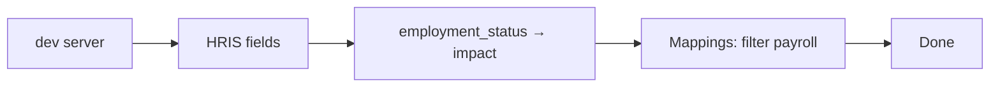

# Acceptance Tests — SourceMap

## Purpose

Manual checklist to confirm the demo matches requirements before a portfolio review.

## Setup

- Node.js 20+
- `npm install` then `npm run dev`
- Latest Chrome or Edge

## Test cases

| ID | Do this | Expect | Req |
|----|---------|--------|-----|
| AT-01 | Open **Systems catalog** | ≥5 systems (HRIS, Payroll, LMS, CRM, DWH) with status | FR-01 |
| AT-02 | Select HRIS | Fields include `employee_id`, `work_email`, `employment_status`; PII on email | FR-02 |
| AT-03 | Open **Field mappings** | ≥10 rows with source → target | FR-03 |
| AT-04 | Filter `payroll` | Payroll-related rows only | FR-04 |
| AT-05 | Any mapping row | Interface name, protocol, frequency visible | FR-05 |
| AT-06 | Impact → `HRIS.employment_status` | Downstream: Payroll, LMS, DWH | FR-06 |
| AT-07 | Same field | Contracts list HRIS→Payroll, LMS, DWH with SLA minutes | FR-07 |
| AT-08 | `employment_status` mappings | Critical on Payroll and LMS paths | FR-08 |
| AT-09 | Offline (optional) | App still loads from local seed | FR-09 |
| AT-10 | Each nav tab | All three views render | FR-10 |
| AT-11 | Fresh clone: install + dev | Vite dev server starts | NFR-01 |
| AT-12 | Keyboard: field row Enter | Navigates to impact | NFR-04 |

## Recruiter demo script (~3 min)

## Sign-off

| Role | Name | Date | Pass |
|------|------|------|------|
| Systems Analyst | Bohlokoa Machaha | | ☐ |
| Reviewer | | | ☐ |
