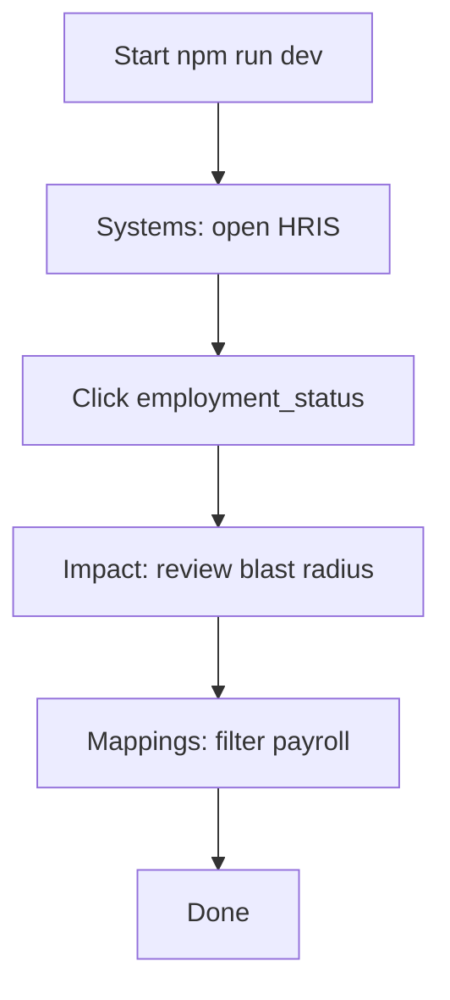

# Acceptance Tests — SourceMap

## Purpose

Manual checklist to validate the portfolio demo against requirements.

## Environment

- Node.js 20+ recommended
- Commands: `npm install`, `npm run dev`
- Browser: Chrome or Edge (latest)

## Test cases

| ID | Steps | Expected result | Req |
|----|-------|-----------------|-----|
| AT-01 | Open app → Systems catalog | ≥5 systems listed (HRIS, Payroll, LMS, CRM, DWH) with status badges | FR-01 |
| AT-02 | Select HRIS | Field table includes `employee_id`, `work_email`, `employment_status`; PII shown for email | FR-02 |
| AT-03 | Open Field mappings | ≥10 rows; each shows source → target | FR-03 |
| AT-04 | Filter mappings with `payroll` | Only payroll-related rows remain | FR-04 |
| AT-05 | Inspect any row | Interface name, protocol, frequency visible | FR-05 |
| AT-06 | Impact → select `HRIS.employment_status` | Downstream includes Payroll, LMS, DWH fields | FR-06 |
| AT-07 | Same field | Interface contracts list HRIS→Payroll, HRIS→LMS, HRIS→DWH with SLA minutes | FR-07 |
| AT-08 | Review employment_status mappings | Critical = Yes on Payroll and LMS paths | FR-08 |
| AT-09 | Disconnect network (optional) | App still loads (local seed) | FR-09 |
| AT-10 | Click each nav tab | Systems, mappings, impact views render without error | FR-10 |
| AT-11 | Fresh clone: install + dev | App serves on Vite default port | NFR-01 |
| AT-12 | Keyboard: focus field row, Enter | Field selects and navigates to impact | NFR-04 |

## Happy-path script (recruiter demo)

## Sign-off

| Role | Name | Date | Pass |
|------|------|------|------|
| Systems Analyst | Bohlokoa Machaha | | ☐ |
| Reviewer | | | ☐ |
